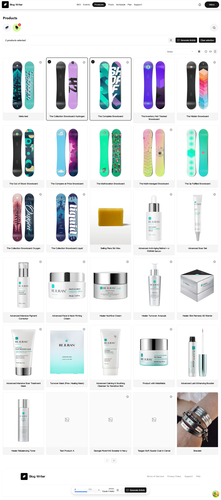

## AI BlogWriter & Scheduler

Generate high-converting, SEO-optimized blog posts for your Shopify store using advanced AI models — tailored directly to your selected products.

### 🎬 Live Demo:

### 📌 Project Overview:

This Shopify application empowers merchants to automatically generate high-quality, SEO-optimized blog articles using their store’s product data. Designed for stores of all sizes, the app streamlines content marketing by transforming product information into engaging, search-friendly blog posts that drive organic traffic and improve search rankings.

By leveraging advanced AI models, the application analyzes product details — including titles, descriptions, and images — to create well-structured, keyword-rich content tailored for maximum visibility. Merchants can select single or multiple products to feature in an article, ensuring flexibility, relevance, and targeted storytelling.

### 🔗 Shopify App Store:

[Shopify Store Link](https://apps.shopify.com/blog-writer-scheduler)

### 📦 Tech Stack

- **Frontend:** React, Typescript
- **Styling & Component Library:** TailwindCSS, ShadcnUI
- **Backend:** Nodejs, ExpressJS, Shopify Admin API
- **Databases:** Amazon DynamoDB (NoSQL)
- **Infrastructure Provisioning:** AWS CDK (Cloud Development Kit) for provisioning infrastructure
- **Infrastructure:** Amazon ECS, VPC, Amazon Bedrock
- **Image Repository:** Amazon ECR
- **Frontend Hostong:** AWS Amplify Hosting for React application
- **AI Models & Inference**: Amazon Bedrock (Claude Models including Haiku, Sonnet)
- **Autmated Build & Deployed (CI/CD)** AWS Codepipeline and CodeBuild

### 🚀 Key Features:

- Multi-product AI-powered blog generation
- Multiple AI models (Claude Haiku, Sonnet) for performance and cost optimization
- Flexible article formats: Regular, Listicle, Comparison, Buying Guide, Product Review, Gift Guide, Roundup, Product Launch
- Multiple writing tones: Conversational, Authoritative, Educational, Persuasive, Storytelling, Analytical, and more
- SEO keyword integration
- Event-based customization (Christmas, Father’s Day, Valentine’s Day, Easter, Independence Day, etc.)
- Shopify discount code embedding
- Article scheduling for automated publishing
- Edit and refine generated articles before publishing
- AI-generated meta titles and descriptions
- Subscription-based and per-article billing models
- Token/context control based on selected AI model
- Article sorting and status management

### 📈 Achivements:

- Reduced Shopify blog article creation time by **90%**
- Successfully published to the Shopify App Store
- Automated CI/CD pipeline eliminating **85%** of manual deployment work
- Reduced infrastructure provisioning time from hours to minutes using Infrastructure as Code (IaC)
- Designed and deployed a scalable AI-driven SaaS application on AWS
